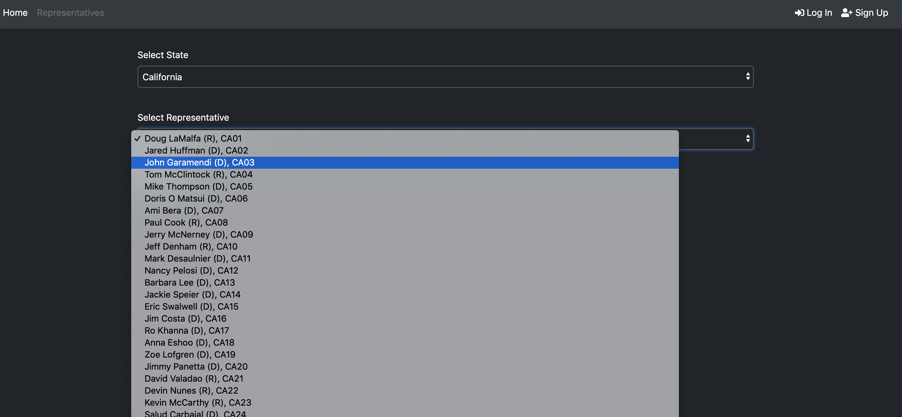
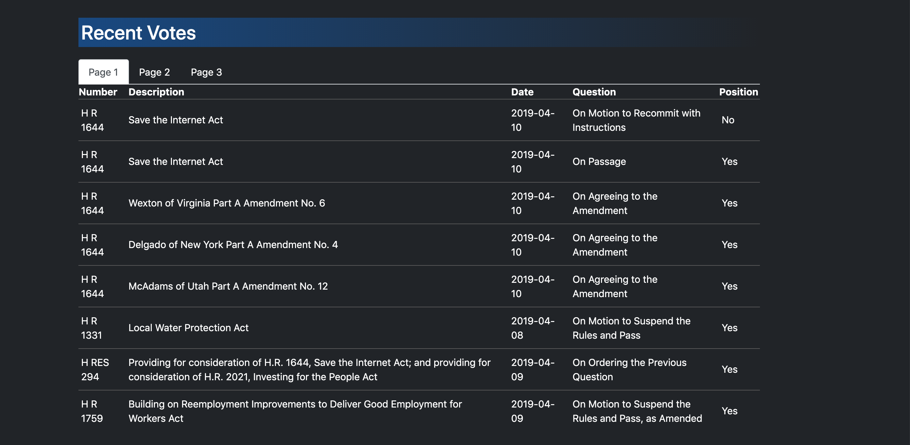
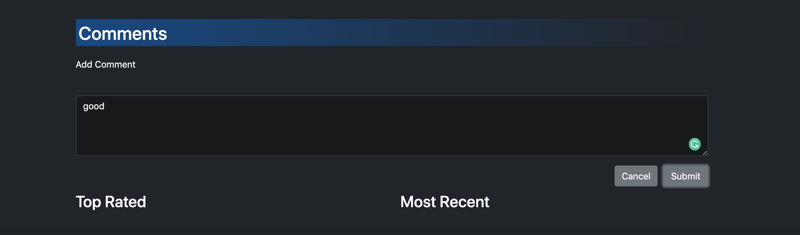

# Project3-Jumping-Jalapeno-JackRabbits

#Instructions
* This is the 'Follow The Money Trail' Homepage. The 'Representatives' tab takes user can find a representative
  by their state and name.

* User can sign up for the 'Follow The Money Trail' application.

* Once the user completes the email confirmation from their email, can login to the application.

* Representative information and the user rating based on their analysis. 

* Source of funds for the representative.

* The recent congress votes by the representative.

* User can leave a comment and rate the representative.

